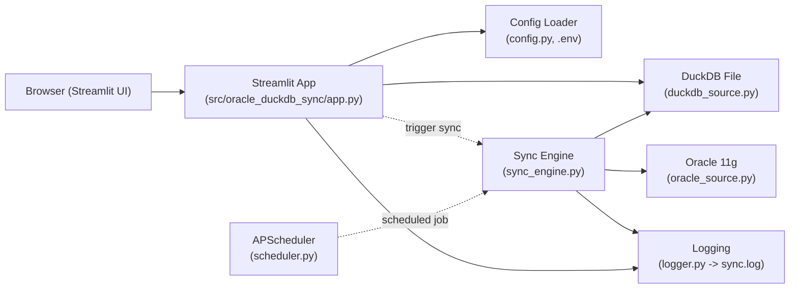

# Oracle-DuckDB Sync: 1단계 구조 파악 메모

## 범위
- 저장소 구조와 주요 모듈 확인
- 데이터 흐름/역할 관계 파악
- 즉시 눈에 띈 인터페이스 이슈 메모

## 시스템 아키텍처

## 구성 요소 요약
- Config (`src/oracle_duckdb_sync/config.py`): `.env` 로드, 필수값 검증, 포트/DB 기본값, DuckDB 테이블명 자동 소문자 변환.
- Logging (`src/oracle_duckdb_sync/logger.py`): 콘솔+파일 핸들러, 중복 핸들러 방지/정리.
- Oracle Source (`src/oracle_duckdb_sync/oracle_source.py`): Thick 모드 초기화(TNS 지원) 후 실패 시 thin 모드 경고; 연결·풀; 커서 상태 유지 페이징; ISO datetime 변환; 스키마 조회.
- DuckDB Source (`src/oracle_duckdb_sync/duckdb_source.py`): 파일 기반 연결; 타입 매핑(NUMBER/CHAR/DATE/TIMESTAMP); 배치 INSERT; 테이블 존재 확인; PRIMARY KEY 포함 DDL 생성.
- Sync Engine (`src/oracle_duckdb_sync/sync_engine.py`): 풀 동기화(스키마→DDL→배치 적재); 재시도 포함 증분 동기화 래퍼; 최대 반복/타임아웃 가드; JSON 기반 상태 저장/로드; `_execute_sync`는 대상 테이블 존재 필요.
- Scheduler (`src/oracle_duckdb_sync/scheduler.py`): BackgroundScheduler + cron 트리거; 락 기반 중복 실행 방지; 컨텍스트 매니저 start/stop.
- UI (`src/oracle_duckdb_sync/app.py`): Streamlit 대시보드; 사이드바에 .env 설정 노출 및 수동 입력; 증분 동기화 트리거; 단순 조회 + Plotly 라인 차트.

## 즉시 확인된 메모(후속 단계에서 검토)
- UI 동기화 버튼이 `SyncEngine.incremental_sync` 시그니처와 맞지 않는 인자를 전달(`time_column`/`primary_key` kwargs 미정의).
- 커버리지 설정 없음. 단위/통합/E2E 테스트 파일은 다수 존재.

## 서비스 가능성 검토(핵심 이슈)
- `sync_engine.full_sync()`가 Oracle 스키마 조회 시 `OracleSource.get_table_schema`를 호출하지만 연결을 열지 않아(`self.conn`이 None) 바로 실패 가능. 사용 전 `oracle.connect()` 필요 (`src/oracle_duckdb_sync/sync_engine.py` / `oracle_source.py`).
- UI의 “지금 동기화 실행” 호출이 `incremental_sync`와 매개변수 불일치(`time_column`/`primary_key` 전달, `column`/`last_value` 누락)로 TypeError 즉시 발생 (`src/oracle_duckdb_sync/app.py` → `sync_engine.incremental_sync`).
- UI에서 증분 동기화만 호출하고 대상 DuckDB 테이블 생성(full sync) 경로가 없어 `_execute_sync`의 테이블 존재 검사에서 ValueError 발생 가능 (`src/oracle_duckdb_sync/app.py`, `sync_engine.py`).
- Thick 모드가 실패하면 thin 모드로 폴백하지만 Oracle 11g는 thin 미지원이므로 Instant Client 경로 설정이 필수(`oracle_source.py`). 운영 배포 시 필수 전제조건으로 명시 필요.

## Gemini 리뷰 대비 보완 포인트
- 테스트 실행/결과 미기록: 아직 `pytest` 실행 결과와 커버리지가 문서에 없음. 실행 후 통계·실패 케이스를 반영해야 함.
- 환경 격리 위험: `load_config()`가 `.env`를 읽으므로 로컬 `.env`가 `test_config.py` 등에 간섭할 수 있음. 테스트 실행 시 환경 변수 모킹/격리 필요 여부 확인해야 함.
- UI 통합 테스트 부재: `app.py` 버튼 핸들러와 SyncEngine 호출 경로가 테스트되지 않아 시그니처 불일치 버그가 노출되지 않음. 통합 테스트 추가 필요.
- 대용량 E2E 안전장치: 대량 동기화/테스트 시 쿼리 범위·limit 미지정으로 과도한 조회 위험. 범위 제어/제한 옵션을 도입해야 함.
