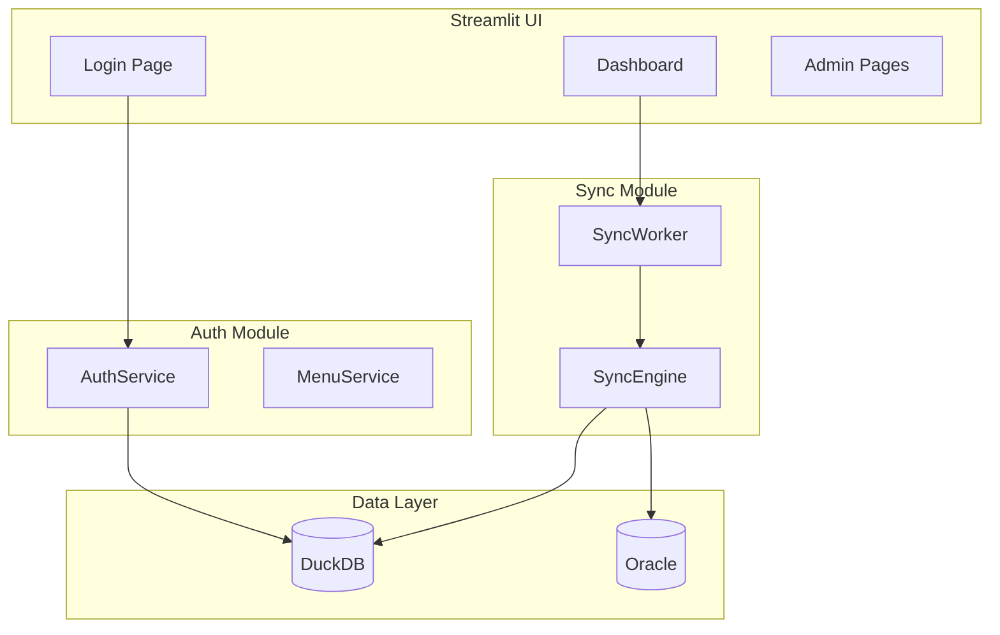

# Phase 02 구현 계획: 계정 관리 및 동기화 모니터링

## 개요
Oracle-DuckDB 동기화 대시보드의 Phase 02 구현 계획입니다.
- **P0 (Critical)**: 실시간 모니터링 및 제어 기능 강화
- **P1 (High)**: 계정/권한/메뉴 관리 시스템 구축

### 설계 결정사항
- **인증 방식**: 세션 기반 (Streamlit session_state 활용)
- **관리자 계정**: 앱 시작 시 환경변수 기반 자동 생성

---

## 1. PRD 요구사항 매핑

| ID | 요구사항 | 우선순위 | 현재 상태 |
|----|----------|----------|----------|
| FR-P02-001 | 동기화 로그·통계 | P1 | 파일 로깅만 존재 |
| FR-P02-002 | 실시간 진행 모니터링 | P0 | 기본 구현 (개선 필요) |
| FR-P02-003 | 동기화 제어 (일시정지/재개/취소) | P0 | 메서드 존재, UI 미연결 |
| FR-P02-004 | 실시간 로그 스트리밍 | P0 | 미구현 |
| FR-P02-005 | 계정 등록/변경/삭제 | P1 | 미구현 |
| FR-P02-006 | 권한 관리 | P1 | 미구현 |
| FR-P02-007 | 메뉴 등록/변경/삭제 | P1 | 미구현 |
| FR-P02-008 | 권한별 메뉴 관리 | P1 | 미구현 |
| FR-P02-009 | 멀티 테이블 설정 | P1 | 단일 테이블만 지원 |
| FR-P02-010 | API 문서 자동 생성 | P1 | 미구현 |
| FR-P02-011 | 아키텍처 다이어그램 | P1 | 미구현 |

---

## 2. 구현 단계

### Phase 2-A: P0 기능 (실시간 모니터링/제어)

#### 2-A-1. 동기화 제어 버튼 연결 (FR-P02-003)
**수정 파일**: `src/oracle_duckdb_sync/ui/handlers.py`

```python
# 추가할 핸들러
def handle_pause_sync():
    if st.session_state.sync_worker:
        st.session_state.sync_worker.pause()
        st.session_state.sync_status = 'paused'

def handle_resume_sync():
    if st.session_state.sync_worker:
        st.session_state.sync_worker.resume()
        st.session_state.sync_status = 'running'

def handle_stop_sync():
    if st.session_state.sync_worker:
        st.session_state.sync_worker.stop()
        st.session_state.sync_status = 'stopped'
```

#### 2-A-2. 실시간 로그 스트리밍 (FR-P02-004)
**신규 파일**: `src/oracle_duckdb_sync/log/log_stream.py`

```python
@dataclass
class LogEntry:
    timestamp: datetime
    level: str          # INFO, WARNING, ERROR
    source: str         # SyncEngine, SyncWorker
    message: str
    details: dict | None = None

class LogStreamHandler(logging.Handler):
    """Queue 기반 실시간 로그 핸들러"""
    def __init__(self, max_size: int = 100):
        self.log_queue = deque(maxlen=max_size)

    def emit(self, record):
        entry = LogEntry(...)
        self.log_queue.append(entry)
```

#### 2-A-3. 동기화 로그/통계 저장 (FR-P02-001)
**신규 파일**:
- `src/oracle_duckdb_sync/models/sync_log.py`
- `src/oracle_duckdb_sync/repository/sync_log_repo.py`

**DuckDB 테이블**:
```sql
CREATE TABLE sync_logs (
    id INTEGER PRIMARY KEY,
    sync_id VARCHAR(36) NOT NULL,
    table_name VARCHAR(255) NOT NULL,
    sync_type VARCHAR(20) NOT NULL,
    status VARCHAR(20) NOT NULL,
    start_time TIMESTAMP NOT NULL,
    end_time TIMESTAMP,
    total_rows INTEGER DEFAULT 0,
    error_message TEXT
);
```

---

### Phase 2-B: P1 기능 (계정/권한/메뉴)

#### 2-B-1. 계정 관리 모듈 (FR-P02-005, FR-P02-006)
**신규 디렉토리**: `src/oracle_duckdb_sync/auth/`

| 파일 | 목적 |
|------|------|
| `models.py` | User, Role 데이터클래스 |
| `repository.py` | DuckDB CRUD |
| `service.py` | 인증/권한 비즈니스 로직 |
| `password.py` | bcrypt 해싱 |

**데이터 모델**:
```python
class UserRole(Enum):
    ADMIN = "admin"
    USER = "user"

@dataclass
class User:
    id: int | None = None
    username: str = ""
    password_hash: str = ""
    role: UserRole = UserRole.USER
    is_active: bool = True
```

**DuckDB 테이블**:
```sql
CREATE TABLE users (
    id INTEGER PRIMARY KEY,
    username VARCHAR(50) UNIQUE NOT NULL,
    password_hash VARCHAR(255) NOT NULL,
    role VARCHAR(20) DEFAULT 'user',
    is_active BOOLEAN DEFAULT TRUE
);

CREATE TABLE roles (
    id INTEGER PRIMARY KEY,
    name VARCHAR(50) UNIQUE NOT NULL,
    permissions TEXT  -- JSON: '["sync:read", "admin:users"]'
);
```

**기본 관리자 자동 생성**:
```python
# app.py 시작 시 실행
def ensure_admin_exists():
    if not user_repo.exists("admin"):
        admin_user = os.getenv("ADMIN_USER", "admin")
        admin_pass = os.getenv("ADMIN_PASSWORD", "admin123")
        auth_service.create_user(admin_user, admin_pass, role=UserRole.ADMIN)
```

#### 2-B-2. 메뉴 관리 모듈 (FR-P02-007, FR-P02-008)
**신규 디렉토리**: `src/oracle_duckdb_sync/menu/`

**데이터 모델**:
```python
@dataclass
class Menu:
    id: int | None = None
    name: str = ""
    path: str = ""              # '/sync', '/admin/users'
    icon: str = ""
    parent_id: int | None = None
    required_permission: str = ""
    is_active: bool = True
```

#### 2-B-3. 멀티 테이블 설정 (FR-P02-009)
**신규 디렉토리**: `src/oracle_duckdb_sync/table_config/`

**데이터 모델**:
```python
@dataclass
class TableConfig:
    oracle_schema: str = ""
    oracle_table: str = ""
    duckdb_table: str = ""
    primary_key: str = ""
    time_column: str = ""
    sync_enabled: bool = True
    batch_size: int = 10000
```

---

### Phase 2-C: 문서화 (FR-P02-010, FR-P02-011)

#### API 문서 (MkDocs)
```
docs/
├── api/
│   ├── index.md
│   ├── auth.md
│   ├── sync.md
│   └── menu.md
└── mkdocs.yml
```

#### 아키텍처 다이어그램 (Mermaid)


---

## 3. 파일 변경 요약

### 신규 생성 (18개)
| 경로 | 목적 |
|------|------|
| `auth/__init__.py` | 인증 모듈 |
| `auth/models.py` | User, Role 모델 |
| `auth/repository.py` | 사용자 CRUD |
| `auth/service.py` | 인증 로직 |
| `auth/password.py` | bcrypt 해싱 |
| `menu/__init__.py` | 메뉴 모듈 |
| `menu/models.py` | Menu 모델 |
| `menu/repository.py` | 메뉴 CRUD |
| `menu/service.py` | 메뉴 필터링 |
| `table_config/__init__.py` | 테이블 설정 모듈 |
| `table_config/models.py` | TableConfig 모델 |
| `table_config/repository.py` | 테이블 설정 CRUD |
| `log/log_stream.py` | 실시간 로그 |
| `models/sync_log.py` | 동기화 로그 모델 |
| `repository/sync_log_repo.py` | 로그 저장소 |
| `ui/pages/login.py` | 로그인 페이지 |
| `ui/pages/admin_users.py` | 사용자 관리 |
| `ui/pages/admin_menus.py` | 메뉴 관리 |

### 수정 대상 (5개)
| 경로 | 변경 내용 |
|------|----------|
| `ui/handlers.py` | 제어 핸들러 추가 |
| `ui/session_state.py` | 인증 상태 추가 |
| `ui/app.py` | 인증 체크, 메뉴 동적 로딩 |
| `scheduler/sync_worker.py` | 진행률 콜백 개선 |
| `config/config.py` | 인증 설정 추가 |

---

## 4. 의존성 추가

```toml
# pyproject.toml
bcrypt = ">=4.0.0"  # 비밀번호 해싱
```

---

## 5. 검증 방법

### 단위 테스트
```bash
pytest test/auth/ -v           # 인증 테스트
pytest test/menu/ -v           # 메뉴 테스트
pytest test/log/ -v            # 로그 스트리밍 테스트
```

### 통합 테스트
```bash
# Streamlit 앱 실행
streamlit run src/oracle_duckdb_sync/ui/app.py

# 테스트 시나리오:
1. 로그인 → 권한별 메뉴 표시 확인
2. 동기화 시작 → 일시정지 → 재개 → 취소
3. 실시간 로그 스트리밍 확인
4. 멀티 테이블 동기화 설정
```

---

## 6. 구현 순서

1. **P0-1**: 동기화 제어 버튼 연결 (`handlers.py` 수정)
2. **P0-2**: 실시간 로그 스트리밍 (`log_stream.py` 신규)
3. **P0-3**: 동기화 로그/통계 저장 (`sync_log.py` 신규)
4. **P1-1**: 계정 관리 모듈 (`auth/` 디렉토리)
5. **P1-2**: 메뉴 관리 모듈 (`menu/` 디렉토리)
6. **P1-3**: 멀티 테이블 설정 (`table_config/` 디렉토리)
7. **P1-4**: 관리자 UI 페이지 (`ui/pages/admin_*.py`)
8. **P1-5**: API 문서 및 다이어그램 (`docs/`)
