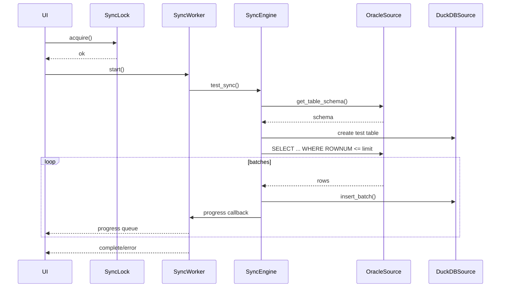

# 시스템 아키텍처 및 세부 데이터 흐름

이 문서는 Oracle → DuckDB 동기화 시스템의 상세 단계별 흐름을 정리한다.

## 1) 구성 요소 요약

- UI: Streamlit 대시보드 (`src/oracle_duckdb_sync/app.py`)
- 동기화 오케스트레이션: 백그라운드 스레드 작업자 (`src/oracle_duckdb_sync/sync_worker.py`)
- 동기화 엔진: 스키마 조회, 테이블 생성, 배치 동기화, 상태/스키마 관리 (`src/oracle_duckdb_sync/sync_engine.py`)
- 데이터 소스: Oracle 연결/쿼리, DuckDB 연결/삽입 (`src/oracle_duckdb_sync/oracle_source.py`, `src/oracle_duckdb_sync/duckdb_source.py`)
- 유틸리티: 환경설정, 로깅, 락, 스케줄러, 데이터 타입 변환 (`config.py`, `logger.py`, `sync_state.py`, `scheduler.py`, `data_converter.py`)

## 2) 코드 레퍼런스 (주요 엔트리 포인트)

| 영역 | 파일 | 주요 클래스/함수 | 설명 |
| --- | --- | --- | --- |
| 환경설정 | `src/oracle_duckdb_sync/config.py` | `Config`, `load_config()` | `.env` 로드/검증 및 기본값 처리 |
| UI | `src/oracle_duckdb_sync/app.py` | `main()`, `check_progress()` | Streamlit UI 렌더링, 동기화 실행/조회/시각화 |
| 동기화 작업자 | `src/oracle_duckdb_sync/sync_worker.py` | `SyncWorker.start()`, `_run_sync()`, `_create_progress_callback()` | 백그라운드 동기화 및 진행률 큐 전송 |
| 동기화 엔진 | `src/oracle_duckdb_sync/sync_engine.py` | `full_sync()`, `test_sync()`, `incremental_sync()`, `sync_in_batches()` | 동기화 파이프라인 실행 및 배치 처리 |
| 상태/스키마 | `src/oracle_duckdb_sync/sync_engine.py` | `save_state()`, `load_state()`, `save_schema_mapping()`, `create_state_checkpoint()` | 상태 저장/복구 및 스키마 버전 관리 |
| Oracle 소스 | `src/oracle_duckdb_sync/oracle_source.py` | `OracleSource.connect()`, `fetch_batch()`, `get_table_schema()` | Oracle 연결 및 배치 조회 |
| DuckDB 소스 | `src/oracle_duckdb_sync/duckdb_source.py` | `DuckDBSource.table_exists()`, `insert_batch()`, `build_create_table_query()` | DuckDB 연결, 삽입, DDL 생성 |
| 동기화 락 | `src/oracle_duckdb_sync/sync_state.py` | `SyncLock.acquire()`, `release()`, `is_locked()` | 동시 실행 방지 |
| 스케줄러 | `src/oracle_duckdb_sync/scheduler.py` | `add_sync_job()`, `create_protected_job()` | 예약 실행 및 중복 방지 |
| 타입 변환 | `src/oracle_duckdb_sync/data_converter.py` | `detect_and_convert_types()` | 문자열 컬럼 자동 타입 변환 |
| 로깅 | `src/oracle_duckdb_sync/logger.py` | `setup_logger()`, `cleanup_logger()` | 로거/핸들러 설정 |

## 3) 전체 데이터 흐름 개요

```mermaid
flowchart LR
  Env[.env] --> Config[load_config()]
  UI[Streamlit UI] --> Config
  UI -->|sync start| Lock[SyncLock]
  Lock --> Worker[SyncWorker]
  Worker --> Engine[SyncEngine]
  Engine --> Oracle[OracleSource] --> OracleDB[(Oracle 11g)]
  Engine --> Duck[DuckDBSource] --> DuckDB[(DuckDB file)]
  Engine --> StateFiles[sync_state.json / schema_mappings.json / sync_progress.json]
  Worker --> Queue[progress_queue]
  Queue --> UI
  UI --> Duck
  UI --> Converter[DataConverter]
  Converter --> Plotly[Plotly charts]
  Scheduler[SyncScheduler] --> Engine
```

## 4) 상세 단계: 테스트 동기화 (Test Sync)

**주요 목적**: 제한된 행 수로 전체 흐름을 빠르게 검증  
**트리거**: UI에서 "테스트 동기화 실행" 클릭

1. `load_config()`로 환경설정 로드
2. `SyncLock.acquire()`로 동시 실행 방지
3. `SyncWorker.start()`가 백그라운드 스레드 시작
4. `SyncEngine.test_sync()` 호출
5. `OracleSource.get_table_schema()`로 스키마 조회
6. `DuckDBSource.map_oracle_type()`로 타입 매핑
7. DuckDB 테스트 테이블 생성 (PK 없음)
8. Oracle 쿼리 실행 (ROWNUM 제한)
9. 배치로 가져와 `DuckDBSource.insert_batch()`로 고속 삽입
10. 진행률은 `SyncWorker`가 큐로 전달 → UI 갱신



## 5) 상세 단계: 전체 동기화 (Full Sync)

**주요 목적**: 최초 전체 적재 및 스키마 생성  
**트리거**: UI에서 "전체 동기화 실행" 클릭, DuckDB 테이블 미존재 시

1. `load_config()`로 환경설정 로드
2. `SyncLock.acquire()`로 동시 실행 방지
3. `SyncWorker.start()`가 백그라운드 스레드 시작
4. `SyncEngine.full_sync()` 호출
5. `OracleSource.get_table_schema()`로 스키마 조회
6. `DuckDBSource.map_oracle_type()`로 타입 매핑
7. `DuckDBSource.build_create_table_query()`로 테이블 생성
8. `SyncEngine.sync_in_batches()` → `_execute_sync()` 실행
9. 배치 단위로 Oracle → DuckDB 적재
10. 진행률/결과는 큐로 UI에 전달

## 6) 상세 단계: 증분 동기화 (Incremental Sync)

**주요 목적**: 마지막 동기화 이후 변경분만 반영  
**트리거**: UI에서 "전체 동기화 실행" 클릭, DuckDB 테이블 존재 시

1. `SyncEngine.load_state()`로 마지막 동기화 시점 조회  
2. `OracleSource.build_incremental_query()`로 증분 쿼리 생성
3. `_execute_sync()` 배치 루프 수행
4. 완료 후 필요한 경우 상태 저장 (`save_state`)

```mermaid
flowchart TD
  Start[Incremental Sync Start] --> LoadState[load_state()]
  LoadState --> BuildQuery[build_incremental_query()]
  BuildQuery --> Loop[batch fetch/insert loop]
  Loop --> Progress[log + progress callback]
  Progress --> Done{rows done?}
  Done -- yes --> End[complete]
  Done -- no --> Loop
```

## 7) 상세 단계: 데이터 조회 및 시각화

**주요 목적**: DuckDB 데이터 조회 및 그래프 표시  
**트리거**: UI에서 "조회" 버튼 클릭

1. DuckDB 연결 확인
2. `SELECT * FROM <table> LIMIT 100` 실행
3. 결과를 `pandas.DataFrame`으로 구성
4. `detect_and_convert_types()`로 문자열 컬럼 자동 변환
5. Plotly로 시계열/수치 컬럼 시각화

## 8) 상태 및 메타데이터 파일

- `sync_state.json`: 테이블별 마지막 동기화 시점
- `schema_mappings.json`: 스키마 매핑 버전 관리
- `sync_progress.json`: 부분 진행 저장
- `data/sync.lock`: 동시 실행 방지용 락 파일

## 9) 스케줄러 실행 흐름 (옵션)

**주요 목적**: 정해진 시간에 자동 동기화  
**구현**: `SyncScheduler.add_sync_job()` + `create_protected_job()`

1. Cron 트리거로 작업 등록
2. 보호 래퍼로 중복 실행 방지
3. 지정 시간에 `SyncEngine` 호출

## 10) 테스트 흐름 및 커버리지 맵

### 10.1 테스트 실행 흐름

1. 기본 단위 테스트: `pytest -v`
2. E2E(실DB) 테스트: `pytest test/test_e2e.py::test_131_incremental_sync_e2e_real_db -v`
3. 성능 테스트: `pytest test/test_performance.py -v`

### 10.2 테스트 파일별 커버리지

| 테스트 파일 | 검증 범위 | 주요 대상 |
| --- | --- | --- |
| `test/test_001.py` | pytest 동작 확인 | 테스트 런타임 |
| `test/test_imports.py` | 의존성 임포트 확인 | `oracledb`, `duckdb`, `streamlit`, `plotly` |
| `test/test_config.py` | 환경설정 로드/기본값 | `load_config()` |
| `test/test_oracle_source.py` | Oracle 연결/쿼리/배치 | `OracleSource` |
| `test/test_duckdb_source.py` | DuckDB ping/타입매핑/DDL | `DuckDBSource` |
| `test/test_sync_engine.py` | 전체/증분/배치/재시도 | `SyncEngine` |
| `test/test_sync_worker.py` | 스레드 생명주기/진행률 큐 | `SyncWorker` |
| `test/test_sync_state.py` | 락 획득/해제/스테일 | `SyncLock` |
| `test/test_scheduler.py` | 스케줄 등록/중복 방지 | `SyncScheduler` |
| `test/test_logger.py` | 로깅 초기화/레벨 | `setup_logger()` |
| `test/test_ui.py` | Streamlit 기본 설정 호출 | `app.main()` |
| `test/test_schema_version.py` | 스키마 버전 관리 | `save_schema_mapping()` |
| `test/test_state_rollback.py` | 체크포인트/롤백/진행 저장 | `create_state_checkpoint()` |
| `test/test_resource_cleanup.py` | 타임아웃/무한루프/정리 | `SyncEngine`, `DuckDBSource` |
| `test/test_performance.py` | 차트/증분 동기화 성능 | Plotly, `SyncEngine` |
| `test/test_e2e.py` | Full Sync 흐름 및 실DB 증분 | `SyncEngine`, `.env` |

## 11) 테스트 실행 시 주의사항

- `test/test_e2e.py::test_131_incremental_sync_e2e_real_db`는 실제 DB 연결이 필요하며 `.env` 설정을 사용한다.
- `test/test_e2e.py`는 실행 중 `TNS_ADMIN`을 `test/`로 설정해 `test/sqlnet.ora`를 사용한다.
- `test/test_sync_worker.py`는 `SyncWorker.pause()`/`resume()`을 호출한다. 현재 `src/oracle_duckdb_sync/sync_worker.py`에는 해당 메서드가 없다.
- `test/test_duckdb_source.py::test_050_batch_insert`는 `executemany` 호출을 기대하지만 현재 `DuckDBSource.insert_batch()`는 Pandas 기반 `execute` 경로를 사용한다.
