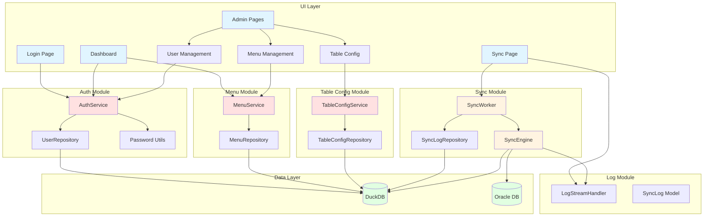
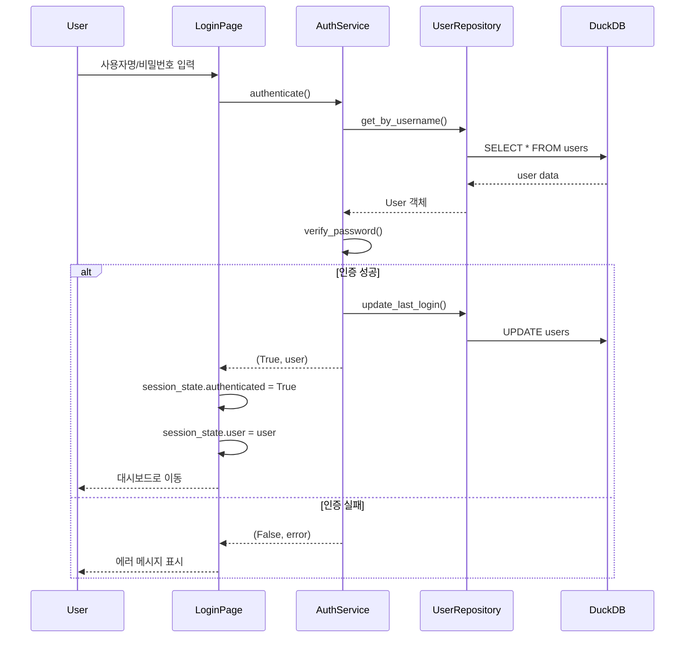
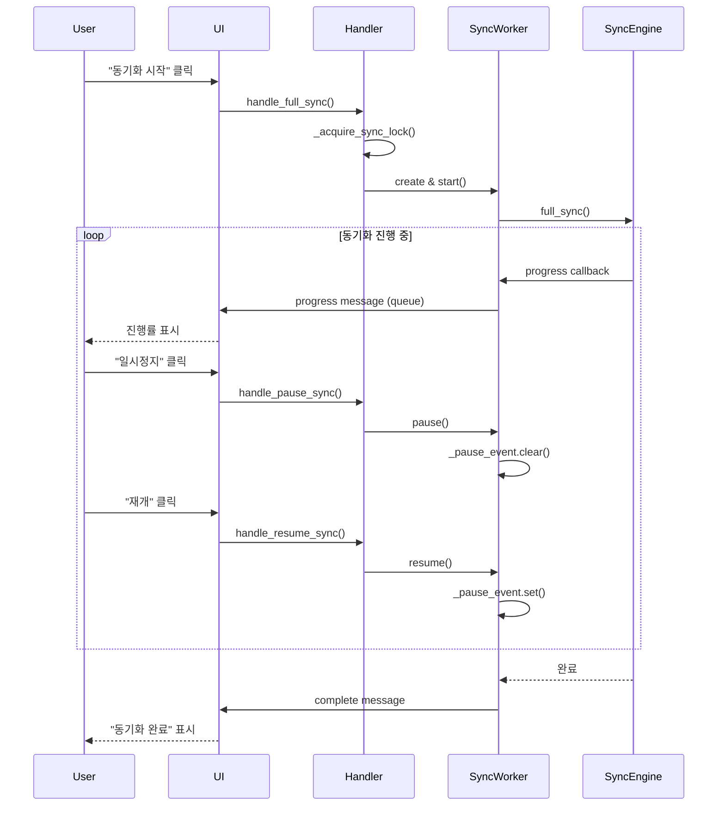

# Phase 02 아키텍처

Oracle-DuckDB 동기화 시스템의 Phase 02 아키텍처 문서입니다.

## 시스템 아키텍처 다이어그램



## 데이터베이스 스키마

### users 테이블

사용자 계정 정보를 저장합니다.

```sql
CREATE TABLE users (
    id INTEGER PRIMARY KEY,
    username VARCHAR(50) UNIQUE NOT NULL,
    password_hash VARCHAR(255) NOT NULL,
    role VARCHAR(20) DEFAULT 'user',
    is_active BOOLEAN DEFAULT TRUE,
    created_at TIMESTAMP DEFAULT CURRENT_TIMESTAMP,
    last_login TIMESTAMP
);
```

### roles 테이블

역할별 권한 정보를 저장합니다.

```sql
CREATE TABLE roles (
    id INTEGER PRIMARY KEY,
    name VARCHAR(50) UNIQUE NOT NULL,
    permissions TEXT,  -- JSON: '["sync:read", "admin:users"]'
    description TEXT
);
```

### menus 테이블

메뉴 구조와 권한을 저장합니다.

```sql
CREATE TABLE menus (
    id INTEGER PRIMARY KEY,
    name VARCHAR(100) NOT NULL,
    path VARCHAR(255) UNIQUE NOT NULL,
    icon VARCHAR(50),
    parent_id INTEGER,
    required_permission VARCHAR(100),
    "order" INTEGER DEFAULT 0,
    is_active BOOLEAN DEFAULT TRUE,
    FOREIGN KEY (parent_id) REFERENCES menus(id) ON DELETE CASCADE
);
```

### table_configs 테이블

동기화 테이블 설정을 저장합니다.

```sql
CREATE TABLE table_configs (
    id INTEGER PRIMARY KEY,
    oracle_schema VARCHAR(100) NOT NULL,
    oracle_table VARCHAR(255) NOT NULL,
    duckdb_table VARCHAR(255) NOT NULL,
    primary_key VARCHAR(100) NOT NULL,
    time_column VARCHAR(100),
    sync_enabled BOOLEAN DEFAULT TRUE,
    batch_size INTEGER DEFAULT 10000,
    description TEXT,
    UNIQUE(oracle_schema, oracle_table)
);
```

### sync_logs 테이블

동기화 작업 이력을 저장합니다.

```sql
CREATE TABLE sync_logs (
    id INTEGER PRIMARY KEY,
    sync_id VARCHAR(36) NOT NULL,
    table_name VARCHAR(255) NOT NULL,
    sync_type VARCHAR(20) NOT NULL,
    status VARCHAR(20) NOT NULL,
    start_time TIMESTAMP NOT NULL,
    end_time TIMESTAMP,
    total_rows INTEGER DEFAULT 0,
    error_message TEXT
);
```

## 모듈별 역할

### Auth Module (인증/권한)

- **AuthService**: 사용자 인증, 권한 검사, 계정 관리
- **UserRepository**: 사용자 데이터 CRUD
- **Password Utils**: bcrypt 기반 비밀번호 해싱 및 검증

**권한 체계**:
- `admin`: 모든 권한
- `user`: 동기화 실행, 로그 조회
- `viewer`: 조회만 가능

### Menu Module (메뉴 관리)

- **MenuService**: 권한 기반 메뉴 필터링, 계층 구조 생성
- **MenuRepository**: 메뉴 데이터 CRUD

**특징**:
- 계층형 메뉴 (parent_id 기반)
- 권한별 메뉴 필터링
- 동적 메뉴 로딩

### Table Config Module (테이블 설정)

- **TableConfigService**: 테이블 설정 관리, 유효성 검증
- **TableConfigRepository**: 설정 데이터 CRUD

**특징**:
- 멀티 테이블 동기화 지원
- 테이블별 배치 크기 설정
- 환경변수 가져오기 기능

### Sync Module (동기화)

- **SyncWorker**: 백그라운드 동기화 실행
- **SyncEngine**: Oracle-DuckDB 데이터 전송
- **SyncLogRepository**: 동기화 이력 저장

**제어 기능**:
- 일시정지 (pause)
- 재개 (resume)
- 중지 (stop)

### Log Module (로그)

- **LogStreamHandler**: 메모리 내 로그 큐 관리
- **LogEntry**: 로그 엔트리 모델

**특징**:
- 실시간 로그 스트리밍
- 최대 크기 제한 (deque maxlen)
- 레벨별 필터링

## 인증 플로우



## 동기화 제어 플로우



## 보안 고려사항

### 비밀번호 보안

- bcrypt 해싱 (기본 rounds=12)
- 평문 비밀번호는 메모리에만 존재
- 강한 비밀번호 정책 (대/소문자, 숫자 포함, 8자 이상)

### 세션 관리

- Streamlit session_state 기반
- 브라우저 종료 시 세션 삭제
- 로그인 시간 추적 (last_login)

### 권한 체크

- 페이지 레벨: `@require_auth` 데코레이터
- 기능 레벨: `has_permission()` 검사
- 관리자는 모든 권한 보유

## 성능 최적화

### 배치 처리

- Pandas DataFrame 기반 벌크 INSERT
- 테이블별 배치 크기 설정 (기본 10,000)

### 로그 관리

- deque의 maxlen으로 메모리 자동 관리
- 오래된 sync_logs 정리 기능

### DB 연결

- DuckDB: 파일 기반, 단일 연결 유지
- Oracle: 커넥션 풀 사용 권장

## 확장 가능성

### 추가 가능한 기능

1. **스케줄링**: 주기적 자동 동기화
2. **알림**: 동기화 완료/실패 알림
3. **모니터링**: Grafana 연동
4. **API**: REST API 제공
5. **다중 데이터베이스**: PostgreSQL, MySQL 등 지원

### 모듈 확장

각 모듈은 독립적으로 확장 가능:
- Auth: OAuth, LDAP 연동
- Menu: 다국어 지원
- Sync: 병렬 동기화, 증분 동기화 개선
