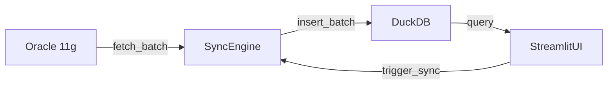

# Oracle-DuckDB Sync - 리팩토링 기회 분석

**프로젝트:** oracle-duckdb-sync
**분석 날짜:** 2025-12-24
**코드 규모:** 약 2,400줄의 Python 소스 코드
**테스트 커버리지:** 69개 테스트, 약 2,600줄

---

## 요약

본 문서는 oracle-duckdb-sync 코드베이스에서 식별된 리팩토링 기회를 정리합니다. 이 프로젝트는 견고한 기능과 TDD 원칙을 잘 따르고 있지만, 다음과 같은 개선이 필요합니다:

- **30-40% 코드 중복** - 동기화 로직과 파일 I/O 작업에서 중복 발생
- **SQL 인젝션 취약점** - 파라미터화되지 않은 쿼리 사용
- **설정 관리 문제** - 코드 전반에 하드코딩된 값들 산재
- **테스트 격차** - UI 레이어 0% 커버리지, 시각화 컴포넌트 미테스트
- **긴 메서드들** - 50줄 이상의 복잡한 중첩 로직을 가진 메서드들

**우선순위 등급:**
- 🔴 **긴급**: 즉각적인 조치가 필요한 보안 취약점
- 🟠 **높음**: 유지보수성에 크게 영향을 주는 코드 품질 문제
- 🟡 **중간**: 장기적 지속 가능성을 향상시키는 개선사항
- 🟢 **낮음**: 선택적 최적화 사항

---

## 목차

1. [보안 취약점](#1-보안-취약점--긴급)
2. [코드 중복](#2-코드-중복--높음)
3. [긴 메서드와 복잡한 로직](#3-긴-메서드와-복잡한-로직--중간)
4. [설정 관리](#4-설정-관리--높음)
5. [에러 처리 문제](#5-에러-처리-문제--중간)
6. [명명 불일치](#6-명명-불일치--낮음)
7. [테스트 격차](#7-테스트-격차--높음)
8. [문서화 필요사항](#8-문서화-필요사항--중간)
9. [구현 로드맵](#9-구현-로드맵)

---

## 1. 보안 취약점 🔴 긴급

### 1.1 DuckDB 테이블 존재 확인의 SQL 인젝션

**위치:** `src/oracle_duckdb_sync/duckdb_source.py:50-56`

**문제:**
```python
def table_exists(self, table_name: str) -> bool:
    try:
        query = f"SELECT COUNT(*) FROM information_schema.tables WHERE table_name = '{table_name}'"
        result = self.conn.execute(query).fetchone()
        return result[0] > 0 if result else False
```

**설명:** 파라미터화 없이 f-string 보간을 사용하여 SQL 인젝션에 취약합니다.

**영향:** 악의적인 테이블 이름으로 임의의 SQL 명령을 실행할 수 있습니다.

**권장 수정:**
```python
def table_exists(self, table_name: str) -> bool:
    try:
        query = "SELECT COUNT(*) FROM information_schema.tables WHERE table_name = ?"
        result = self.conn.execute(query, [table_name]).fetchone()
        return result[0] > 0 if result else False
```

---

### 1.2 증분 쿼리 빌더의 SQL 인젝션

**위치:** `src/oracle_duckdb_sync/oracle_source.py:181`

**문제:**
```python
def build_incremental_query(self, table_name: str, column_name: str, last_value: str) -> str:
    return f"SELECT * FROM {table_name} WHERE {column_name} > '{last_value}'"
```

**설명:** 파라미터화 없이 f-string으로 SQL 쿼리를 구성합니다.

**영향:** 악의적인 SQL을 포함한 테이블명, 컬럼명, 값이 데이터베이스를 손상시킬 수 있습니다.

**권장 수정:**
```python
def build_incremental_query(self, table_name: str, column_name: str, last_value: str) -> str:
    # 테이블/컬럼명에 식별자 인용 사용
    safe_table = self._quote_identifier(table_name)
    safe_column = self._quote_identifier(column_name)
    return f"SELECT * FROM {safe_table} WHERE {safe_column} > :last_value"
    # 그 다음 바인드 파라미터 사용: cursor.execute(query, last_value=last_value)
```

---

### 1.3 여러 곳의 파라미터화되지 않은 쿼리

**위치:**
- `src/oracle_duckdb_sync/duckdb_source.py:76` - `build_create_table_query()`
- `src/oracle_duckdb_sync/sync_engine.py:214` - 동적 SQL 구성

**문제:** 여러 위치에서 사용자 제어 입력으로 f-string을 사용하여 SQL 쿼리를 구성합니다.

**권장 조치:**
1. 모든 SQL 쿼리 구성 감사
2. 모든 값에 대해 파라미터화된 쿼리 사용
3. 테이블/컬럼명에 대한 식별자 인용/검증 사용
4. 테스트 스위트에 SQL 인젝션 테스트 추가

---

## 5. 에러 처리 문제 🟡 중간

### 5.1 무언의 실패를 하는 베어 Except

**위치:** `src/oracle_duckdb_sync/data_query.py:101`

**문제:**
```python
try:
    # 어떤 작업
except:
    pass  # 로깅 없는 무언의 실패
```

**설명:** 로깅 없이 모든 예외를 무시합니다.

**권장 수정:**
```python
try:
    # 어떤 작업
except Exception as e:
    logger.warning(f"작업 실패: {e}")
    # 또는 중요한 경우 재발생
```

---

### 5.2 모든 것을 잡는 예외 핸들러

**위치:** 여러 파일에서 특정 타입이 더 나을 때 `Exception`을 잡습니다.

**예시:**
```python
# 다음 대신:
except Exception as e:
    logger.error(f"에러: {e}")

# 특정 예외 사용:
except (DatabaseError, TimeoutError) as e:
    logger.error(f"데이터베이스 작업 실패: {e}")
except ValueError as e:
    logger.error(f"잘못된 설정: {e}")
```

**권장 조치:** 모든 예외 핸들러를 감사하고 특정 예외 타입 사용.

---

### 5.3 누락된 에러 처리

**격차:**
- 작업 전에 Oracle 연결이 존재하는지 검증 없음
- DuckDB 디스크 가득 참 시나리오에 대한 처리 없음
- 동기화 중 네트워크 중단에 대한 우아한 처리 없음
- 손상된 .lock 파일에 대한 검증 누락

**권장 테스트:**
- 디스크 가득 참 시나리오 테스트
- 네트워크 중단 복구 테스트
- 손상된 상태 파일 처리 테스트
- 동시 락 경합 테스트

---

## 6. 명명 불일치 🟢 낮음

### 6.1 일관성 없는 변수 명명

**문제:** 코드베이스 전반에 걸친 혼재된 명명 패턴.

**예시:**
```python
# 일관성 없는 컬럼 명명
duckdb_columns  # sync_engine.py
available_y_cols  # visualization.py
numeric_cols  # data_query.py

# 일관성 없는 테이블 명명
table_name  # 일반적
oracle_table  # 접두사 있음
duckdb_table  # 접두사 있음

# 일관성 없는 컬럼 반복
col_name  # 어떤 곳
column  # 다른 곳
col  # 약어 형태
```

**권장 표준:**
```python
# 설명적이고 일관된 이름 사용
oracle_table_name / duckdb_table_name  # 명확성을 위해 항상 접두사
column_name / column_names  # 약어 없이 전체 단어
datetime_columns / numeric_columns  # 설명적이고 일관된 접미사
```

---

### 6.2 일관성 없는 파라미터 명명

**문제:**
```python
row_limit  # sync_engine.py
max_duration  # max_ 접두사 사용

batch_size  # 때로는 파라미터, 때로는 config에서
```

**권장사항:** 제한/최대값에 대해 일관된 접두사 사용.

---

## 7. 테스트 격차 🟠 높음

### 7.1 UI 레이어 - 0% 커버리지

**테스트되지 않은 파일:**
- `app.py` (149줄) - 메인 Streamlit 진입점
- `ui_handlers.py` (253줄) - 동기화 UI 핸들러
- `session_state.py` (47줄) - 세션 관리
- `visualization.py` (157줄) - 차트 렌더링
- `data_query.py` (160줄) - 쿼리 인터페이스

**총 테스트되지 않음:** 450줄 이상의 UI 코드

**누락된 테스트 시나리오:**
```python
# 세션 상태
- test_session_state_initialization
- test_session_state_reset
- test_sync_lock_release_on_session_end

# UI 핸들러
- test_handle_test_sync_success
- test_handle_test_sync_lock_contention
- test_handle_full_sync_error_display
- test_progress_callback_updates_ui

# 시각화
- test_chart_rendering_with_datetime_x_axis
- test_multiple_y_axis_selection
- test_reference_line_calculation
- test_chart_type_switching
```

**권장 조치:** 15-20개 테스트로 `test_ui_integration.py` 생성.

---

### 7.2 통합 시나리오 - 제한된 커버리지

**현재:** 오직 2개의 E2E 테스트만
- `test_130_full_sync_e2e`
- `test_131_incremental_sync_e2e_real_db`

**누락된 시나리오:**
```python
- test_ui_to_db_query_flow
- test_sync_failure_and_recovery
- test_concurrent_user_access_during_sync
- test_scheduler_triggered_sync
- test_configuration_change_handling
- test_state_file_corruption_recovery
- test_lock_file_stale_detection
```

**권장 조치:** 8-10개 통합 테스트 추가.

---

### 7.3 에러 처리 엣지 케이스

**테스트되지 않은 시나리오:**
| 시나리오 | 상태 |
|----------|--------|
| 동기화 중 DuckDB 디스크 가득 참 | ❌ 테스트 없음 |
| 배치 중간에 Oracle 연결 타임아웃 | ⚠️ 부분적 |
| 손상된 .lock 파일 | ❌ 테스트 없음 |
| 잘못된 CSV/Excel 다운로드 | ❌ 테스트 없음 |
| 동기화 시작 후 스키마 불일치 | ❌ 테스트 없음 |
| 복합 기본 키 | ❌ 테스트 없음 |
| 테이블 이름의 특수 문자 | ❌ 테스트 없음 |
| 매우 긴 테이블/컬럼 이름 | ❌ 테스트 없음 |
| 문자 인코딩 문제 | ⚠️ 최소한 |

**권장 조치:** 10-15개 테스트로 `test_edge_cases.py` 생성.

---

### 7.4 설정 검증

**누락된 테스트:**
```python
- test_config_empty_sync_duckdb_table_uses_oracle_name
- test_config_composite_primary_key_handling
- test_config_composite_time_column_handling
- test_config_special_characters_in_paths
- test_config_very_long_table_names
- test_config_invalid_port_range
- test_config_missing_required_field_error_message
```

---

## 8. 문서화 필요사항 🟡 중간

### 8.1 누락된 아키텍처 다이어그램

**필요사항:**
- C4 모델 다이어그램 (Context, Container, Component, Code)
- 데이터 흐름 다이어그램 (Oracle → DuckDB → UI)
- UI 컴포넌트 계층
- 동기화 흐름을 위한 시퀀스 다이어그램

**권장 도구:** 문서에 Mermaid 다이어그램

**예시:**
````markdown

````

---

### 8.2 누락된 운영 문서

**필요사항:**
- 일반적인 문제에 대한 문제 해결 가이드
- 성능 튜닝 가이드
- DuckDB 파일에 대한 백업 및 복구 절차
- 모니터링 및 관찰 가능성 설정
- 프로덕션 배포 체크리스트
- dev/staging/prod를 위한 환경 설정
- 컨테이너화 가이드 (Docker/Kubernetes)

**권장 파일:**
- `docs/operations/troubleshooting.md`
- `docs/operations/deployment.md`
- `docs/operations/monitoring.md`

---

### 8.3 누락된 API 문서

**필요사항:**
- 공개 메서드에 대한 독스트링
- 반환 값에 대한 타입 힌트
- 데이터 스키마 문서
- 동기화 파라미터 레퍼런스
- 설정 레퍼런스

**예시:**
```python
def full_sync(
    self,
    oracle_table: str,
    duckdb_table: str,
    batch_size: int = 10000,
    max_duration: int = 3600
) -> dict:
    """
    Oracle에서 DuckDB로 전체 동기화를 수행합니다.

    Args:
        oracle_table: Oracle의 소스 테이블 이름 (예: 'SALES_DATA')
        duckdb_table: DuckDB의 대상 테이블 이름 (예: 'sales_data')
        batch_size: 배치당 가져올 행 수 (기본값: 10000)
        max_duration: 최대 동기화 지속 시간(초) (기본값: 3600)

    Returns:
        dict: 다음 키를 가진 동기화 통계:
            - total_rows: int
            - elapsed_time: float
            - rows_per_second: float
            - batches_processed: int

    Raises:
        ValueError: Oracle이 연결되지 않았거나 테이블이 존재하지 않는 경우
        DatabaseError: 동기화 작업이 실패한 경우

    Example:
        >>> engine = SyncEngine(config)
        >>> stats = engine.full_sync('SALES', 'sales_data', batch_size=5000)
        >>> print(f"{stats['total_rows']}행을 {stats['elapsed_time']:.2f}초에 동기화")
    """
```

---

### 8.4 누락된 테스트 문서

**필요사항:**
- 테스트 데이터 생성 가이드
- 목 데이터 설정 문서
- 테스트 계획의 예상/실제 결과 세부사항
- 테스트 환경 설정 지침

---

## 9. 구현 로드맵

### 1단계: 보안 수정 🔴 긴급 (1-2일)

**우선순위:** 즉시

1. **SQL 인젝션 취약점 수정**
   - [ ] `duckdb_source.py`의 `table_exists()` 쿼리 파라미터화
   - [ ] `oracle_source.py`의 `build_incremental_query()` 파라미터화
   - [ ] 모든 SQL 쿼리 구성 감사
   - [ ] SQL 인젝션 테스트 추가

2. **SQL 유틸리티 함수 생성**
   - [ ] 안전한 테이블/컬럼 이름을 위한 `_quote_identifier()` 구현
   - [ ] 파라미터화된 쿼리 빌더 헬퍼 생성
   - [ ] 사용자 제어 SQL 입력에 대한 검증 추가

**예상 노력:** 8-12시간

---

### 2단계: 설정 중앙화 🟠 높음 (2-3일)

**우선순위:** 높음

1. **Config 클래스 확장**
   - [ ] 배치 크기 설정 추가
   - [ ] 파일 경로 설정 추가
   - [ ] 재시도/타임아웃 설정 추가
   - [ ] 타입 감지 임계값 추가

2. **Config를 사용하도록 모든 코드 업데이트**
   - [ ] 하드코딩된 배치 크기 교체
   - [ ] 하드코딩된 파일 경로 교체
   - [ ] 하드코딩된 임계값 교체

3. **설정 검증 추가**
   - [ ] 파일 경로가 접근 가능한지 검증
   - [ ] 숫자 범위 검증
   - [ ] Pydantic 스키마 추가 (선택사항)

**예상 노력:** 12-16시간

---

### 3단계: 코드 중복 제거 🟠 높음 (3-4일)

**우선순위:** 높음

1. **동기화 엔진 리팩토링**
   - [ ] `_prepare_sync()` 메서드 추출
   - [ ] full_sync/test_sync 로직 통합
   - [ ] `StateFileManager` 기본 클래스 생성
   - [ ] 파일 I/O 작업 리팩토링

2. **UI 핸들러 리팩토링**
   - [ ] `_acquire_sync_lock_with_ui()` 헬퍼 추출
   - [ ] 에러 처리 패턴 통합

3. **긴 메서드 분해**
   - [ ] `_execute_limited_sync()`를 4-5개 메서드로 분할
   - [ ] `render_data_visualization()`을 집중된 함수들로 분할
   - [ ] `detect_and_convert_types()`를 감지 + 변환으로 분할

**예상 노력:** 16-24시간

---

### 4단계: 테스트 격차 🟠 높음 (4-5일)

**우선순위:** 높음

1. **UI 레이어 테스팅**
   - [ ] `test_ui_integration.py` 생성 (15-20 테스트)
   - [ ] 세션 상태 관리 테스트
   - [ ] 동기화 버튼 핸들러 테스트
   - [ ] 진행률 콜백 통합 테스트

2. **시각화 테스팅**
   - [ ] `test_visualization.py` 생성 (10-15 테스트)
   - [ ] 차트 렌더링 테스트
   - [ ] 데이터 쿼리 필터링 테스트

3. **통합 테스팅**
   - [ ] `test_integration.py` 생성 (8-10 테스트)
   - [ ] UI-to-DB 쿼리 흐름 테스트
   - [ ] 실패 복구 시나리오 테스트

4. **엣지 케이스 테스팅**
   - [ ] `test_edge_cases.py` 생성 (10-15 테스트)
   - [ ] 에러 처리 엣지 케이스 테스트
   - [ ] 설정 검증 테스트
   - [ ] 문자 인코딩 문제 테스트

**예상 노력:** 24-32시간

---

### 5단계: 에러 처리 🟡 중간 (2-3일)

**우선순위:** 중간

1. **베어 except 절 교체**
   - [ ] 모든 예외 핸들러 감사
   - [ ] 특정 예외 타입 사용
   - [ ] 모든 에러 경로에 로깅 추가

2. **누락된 에러 처리 추가**
   - [ ] 작업 전에 연결 검증
   - [ ] 디스크 가득 참 시나리오 처리
   - [ ] 네트워크 중단을 우아하게 처리
   - [ ] 손상된 상태 파일에서 검증/복구

**예상 노력:** 12-16시간

---

### 6단계: 문서화 🟡 중간 (3-4일)

**우선순위:** 중간

1. **아키텍처 다이어그램**
   - [ ] C4 모델 다이어그램 생성
   - [ ] 데이터 흐름 다이어그램 생성
   - [ ] 시퀀스 다이어그램 생성

2. **운영 문서**
   - [ ] 문제 해결 가이드 작성
   - [ ] 배포 가이드 작성
   - [ ] 모니터링 가이드 작성
   - [ ] 성능 튜닝 가이드 작성

3. **API 문서**
   - [ ] 포괄적인 독스트링 추가
   - [ ] 타입 힌트 추가
   - [ ] 설정 레퍼런스 생성
   - [ ] API 레퍼런스 가이드 생성

**예상 노력:** 16-24시간

---

### 7단계: 명명 일관성 🟢 낮음 (1-2일)

**우선순위:** 낮음

1. **명명 표준화**
   - [ ] 모듈 전반의 일관된 변수 명명
   - [ ] 일관된 파라미터 명명
   - [ ] 명명 규칙 가이드 생성

2. **코드 스타일 적용**
   - [ ] 코드 포맷팅을 위한 black 설정
   - [ ] 린팅을 위한 flake8 설정
   - [ ] 타입 체킹을 위한 mypy 설정
   - [ ] pre-commit 훅 추가

**예상 노력:** 8-12시간

---

## 요약

**총 예상 노력:** 96-136시간 (12-17일)

**우선순위별 로드맵:**
1. 🔴 **1주차:** 보안 수정 + 설정 중앙화 (3-4일)
2. 🟠 **2주차:** 코드 중복 제거 (3-4일)
3. 🟠 **3주차:** 테스트 격차 (4-5일)
4. 🟡 **4주차:** 에러 처리 + 문서화 (5-7일)
5. 🟢 **5주차:** 명명 일관성 + 코드 스타일 (1-2일)

**크리티컬 패스:** 보안 → 설정 → 중복 → 테스팅

**추적할 주요 지표:**
- 코드 중복: 목표 <10% (현재 30-40%)
- 테스트 커버리지: 목표 80%+ (현재 UI 격차로 약 60%)
- SQL 인젝션 취약점: 목표 0 (현재 3개 이상)
- 하드코딩된 값: 목표 <5 (현재 15개 이상)
- 긴 메서드 (>50줄): 목표 0 (현재 3개)

---

## 부록: 파일 참조

**소스 코드 (2,398줄):**
- `src/oracle_duckdb_sync/` (15개 모듈)

**테스트 (2,582줄):**
- `test/` (17개 테스트 파일)

**설정:**
- `.env`, `.env.example`, `pyproject.toml`

**문서:**
- `README.md`, `CLAUDE.md`, `docs/`
