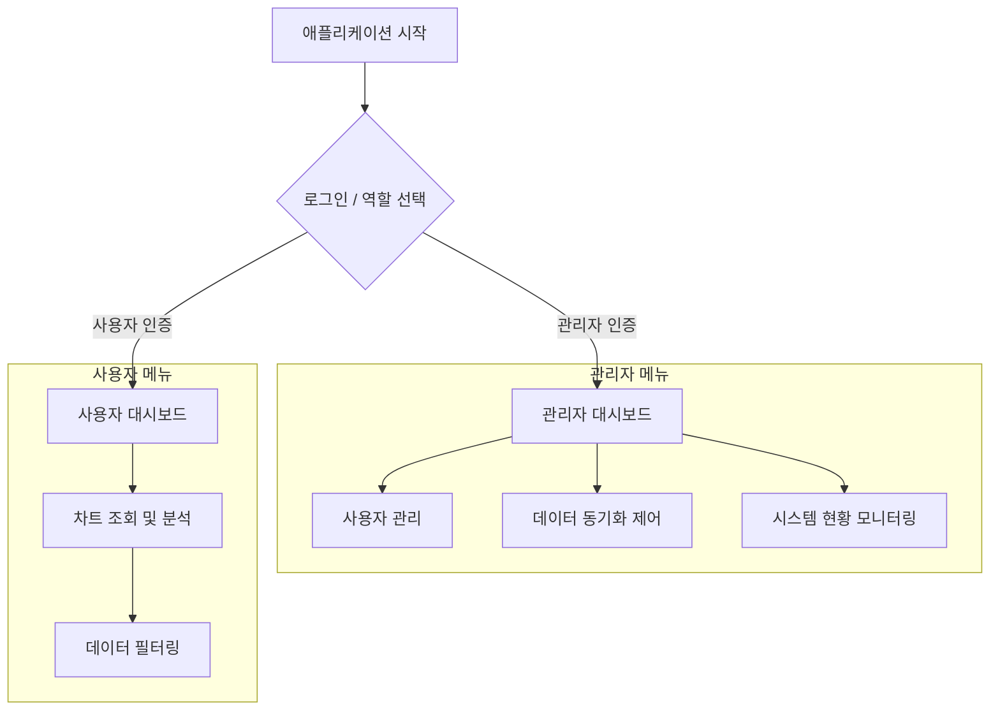

# Oracle-DuckDB Sync 시스템 UI 디자인 설계서 (Gemini Ver.)

## 1. 개요
본 문서는 `oracle-duckdb-sync` 애플리케이션의 사용자 인터페이스(UI)를 관리자와 일반 사용자로 분리하여 운영 효율성과 데이터 접근성을 높이기 위한 디자인 설계서입니다. 본 시스템은 Streamlit 프레임워크를 기반으로 구현되는 것을 가정하여 설계되었습니다.

---

## 2. 정보 구조 (Information Architecture)

시스템은 크게 **로그인(진입)**, **관리자 영역**, **사용자 영역**으로 구분됩니다.

---

## 3. 화면별 상세 설계

### 3.1. 진입 화면 (로그인)
애플리케이션 접속 시 가장 먼저 표시되는 화면입니다.

- **레이아웃**: 중앙 정렬 카드 형태
- **구성 요소**:
  - 시스템 로고 및 타이틀
  - 사용자 ID 입력 필드
  - 비밀번호 입력 필드
  - **로그인 버튼**: 인증 성공 시 해당 사용자의 역할(Admin/User)에 따라 해당 세션으로 리다이렉트

### 3.2. 관리자 모드 (Admin Mode)
시스템의 전반적인 설정을 관리하고 상태를 모니터링합니다. 사이드바를 통해 네비게이션합니다.

#### A. 사용자 관리 (User Management)
- **목적**: 시스템에 접근 가능한 사용자를 등록하고 역할을 할당합니다.
- **UI 구성**:
  - **상단**: '사용자 추가' 버튼.
  - **메인**: 사용자 목록 데이터 그리드.
    - 컬럼: ID, 이름, 역할(Admin/User), 등록일, 최근 접속일.
    - 액션: 수정(Edit), 삭제(Delete), 비밀번호 초기화.

#### B. 데이터 동기화 (Data Synchronization)
- **목적**: Oracle에서 DuckDB로의 데이터 이동을 제어하고 설정을 변경합니다.
- **UI 구성**:
  - **상태 패널**: 현재 동기화 상태 (대기 중, 동기화 중, 에러) 표시.
  - **제어 패널**:
    - `수동 동기화 시작` 및 `중지` 버튼.
  - **설정 영역 (Expander)**:
    - 소스/타겟 연결 정보 확인.
    - 스케줄링 설정 (매일, 매시간 등 인터벌 선택).
  - **최근 동기화 이력**: 실행 성공/실패 기록 테이블.

#### C. 시스템 현황 (System Status)
- **목적**: 서버 리소스 및 애플리케이션 로그를 확인합니다.
- **UI 구성**:
  - **KPI 지표 (Metrics)**:
    - CPU/메모리 사용률, DuckDB 파일 용량.
  - **로그 뷰어**:
    - 로그 레벨 필터(INFO/WARN/ERROR)가 포함된 실시간 로그 창.

---

### 3.3. 사용자 모드 (User Mode)
데이터를 시각화하고 분석하는 데 초점을 맞춥니다.

#### A. 데이터 필터링 (Data Filtering - Sidebar)
- **위치**: 좌측 사이드바 고정.
- **구성 요소**:
  - **기간 선택**: 날짜 범위 선택 (Date Range Picker).
  - **데이터 소스 선택**: 테이블/뷰 선택 드롭다운.
  - **태그/카테고리 필터**: 다중 선택(Multi-select) 박스.
  - **샘플링 설정**: 차트 해상도(LTTB 알고리즘 적용 수준) 조절 슬라이더.

#### B. 차트 조회 (Chart Visualization - Main Area)
- **위치**: 메인 콘텐츠 영역.
- **구성 요소**:
  - **메인 시계열 차트**: 인터랙티브 라인 차트 (Zoom/Pan 지원).
  - **통계 요약 카드**: 최소/최대/평균 및 전일 대비 증감 표시.
  - **데이터 그리드**: 차트 하단에 원본 데이터 테이블 및 CSV 다운로드 버튼 제공.

---

## 4. UI/UX 디자인 가이드라인

- **일관성**: 관리자 화면은 정보 전달 위주, 사용자 화면은 가독성 위주의 레이아웃 구성.
- **피드백**: 동기화 등 긴 작업 시 Spinner와 Progress Bar 노출.
- **색상**: 신뢰감을 주는 네이비(Primary)와 상태를 나타내는 신호등 색상(Green/Yellow/Red) 활용.
